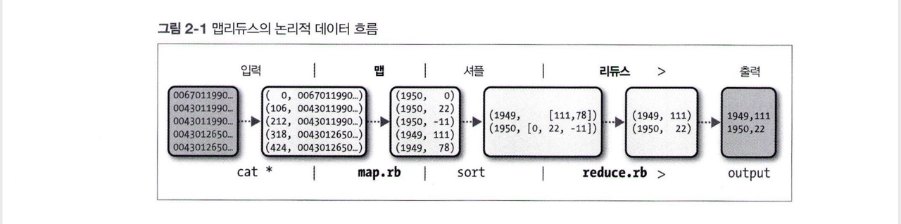

# 관계형 데이터베이스 관리 시스템
- **맵 리듀스**
    - 비정형 분석과 같이 일괄 처리 방식으로 전체 데이터셋을 분석할 필요가 있는 문제에 적합함
    - 데이터를 한 번 쓰고 여러 번 읽는 애플리케이션에 적합함
- **RDBMS**
    - Relational Database Management System
    - 상대적으로 작은 양의 데이터를 낮은 지연 시간에 추출하고 변경하기 위해 데이터셋을 색인하기 때문에 특정 쿼리와 데이터 변경에 적합함
    - 지속적으로 변경되는 데이터셋에 적합함

- 비교

| | 전통적인 RDBMS | 맵리듀스 |
|---|---|---|
| 데이터 크기 | 기가바이트 | 페타바이트 |
| 접근 방식 | 대화형과 일괄 처리 방식 | 일괄 처리 방식 |
| 변경 | 여러 번 읽고 쓰기 | 한 번 쓰고 여러 번 읽기 |
| 트랜잭션 | ACID | 없음 |
| 구조 | 쓰기 기준 스키마 | 읽기 기준 스키마 |
| 무결성 | 높음 | 낮음 |
| 확장성 | 비선형 | 선형 |

- ACID
    - Atomicity: 원자성
    - Consistnecy: 일관성
    - Isolation: 격리성
    - Durability: 영속성

- **정형 데이터**(structured data)
    - XML 문서나 미리 정의된 특정 스키마를 가진 데이터베이스 테이블과 같이 형식이 정의된 항목으로 구조화되어 있음
    - RDBMS의 영역
- **반정형 데이터**(semi-structured data)
    - 정형 데이터에 비해 스키마가 유연하거나 심지어 생략될 수 있음 => 데이터 구조에 대한 최소한의 규칙만 있으면 됨
    - 예: 그리드 형태의 셀 구조로 된 스프레드시트는 셀 자체에 어떤 형태의 데이터도 담을 수 있음
- **비정형 데이터**(unstructured data)
    - 어떠한 내부 구조도 없음
    - 예: 일반 텍스트나 이미지 데이터
- **읽기 시점 스키마**(schema-on-read)
    - 하둡은 처리 시점에 데이터를 해석하도록 설계되어 있기 때문에 비정형 데이터나 반정형 데이터도 잘 처리할 수 있음
    - 유연성 제공
    - 데이터를 불러오는 비용이 많이 드는 단계(RDBMS에서 필요한)를 피할 수 있음

- 무결성
    - 관계형 데이터는 무결성을 유지하고 중복을 제거하기 위해 주기적으로 **정규화**(normalize)됨
    - 하둡은 비지역 연산으로 레코드를 읽고, 고속의 순차적 읽기와 쓰기를 수행하기 때문에 정규화가 문제가 됨
    - 로그 파일: 정규화되지 않은 레코드셋의 좋은 예, 하둡으로 분석하기 적합함

- 선형 구조
    - 맵리듀스와 다양한 하둡의 처리 모델은 데이터의 크기에 따라 선형으로 확장됨
    - 데이터는 분할되고 맵과 리듀스와 같은 기본 함수는 분리된 파티션에서 병렬로 데이터를 처리함

# 맵과 리듀스
- 맵리듀스: 맵 & 리듀스 => 입력과 출력으로 키-값의 쌍을 가짐

- 연도별 전 세계 최고 기온 구하기
    - 맵
        - 데이터의 준비 단계, 리듀스 함수를 위해 데이터를 제공하는 역할
        - 잘못된 레코드를 걸러주는 작업은 맵 함수에서 수행하는 것이 적합함
        - 각 행에서 연도와 기온을 추출
    1. 데이터 입력
    2. 데이터의 각 행이 키-값 쌍으로 변환되어 맵 함수의 입력이 됨
    3. 맵 함수는 연도와 기온을 추출하여 출력으로 내보냄
        - 맵 함수의 출력이 리듀스 함수의 입력으로 보내지는 과정은 맵리듀스 프레임워크에 의해 처리됨
        - 키-값은 쌍을 기준으로 정렬되고 그룹화됨
        - 맵 함수의 키는 연도, 값은 기온
    4. 연도별로 측정된 모든 기온값이 하나의 리스트로 묶임
    5. 리듀스 함수는 리스트 전체를 반복하여 최고 측정값을 추출    

# HDFS 설계
- HDFS는 **범용 하드웨어**로 구성된 클러스터에서 실행되고 **스트리밍 방식의 데이터 접근** 패턴으로 **대용량 파일**을 다룰 수 있도록 설계된 파일시스템임
- HDFS의 설계 특성
    - **매우 큰 파일**
        - 수백 메가바이트, 기가바이트, 테라바이트 또는 페타바이트 크기의 파일
    - **스트리밍 방식의 데이터 접근**
        - HDFS는 '가장 효율적인 데이터 처리 패턴은 한 번 쓰고 여러 번 읽는 것'이라는 아이디어에서 출발함
        - 데이터셋은 생성되거나 원본으로부터 복사됨
        - 시간이 흐르면서 다양한 분석을 수행할 수 있음
        - 분석이 전부는 아니지만 첫 번째 레코드를 읽는 데 걸리는 지연 시간보다 전체 데이터셋을 모두 읽을 때 걸리는 시간이 더 중요함
    - **범용 하드웨어**
        - 하둡은 고가의 신뢰도 높은 하드웨어만을 고집하지는 않음
        - 노드 장애가 발생할 확률이 높은 범용 하드웨어(여러 업체에서 제공하는 쉽게 구할 수 있는 하드웨어)로 구성된 대형 클러스터에서 문제없이 실행되도록 설계됨
        - HDFS는 이러한 장애가 발생하더라도 사용자가 장애가 발생했다는 사실조차 모르게 작업을 수행하도록 설계됨
- 현재 HDFS가 잘 맞지 않는 응용 분야
    - **빠른 데이터 응답 시간**
        - 데이터 접근에 수십 밀리초 수준의 빠른 응답 시간을 요구하는 애플리케이션은 HDFS와 맞지 않음
        - 높은 데이터 처리량을 제공하기 위해 최적화되어 있고 이를 위해 응답 시간을 희생함
        - 빠른 응답 시간을 원한다면 현재로서는 HBase가 하나의 대안이 될 수 있음
    - **수많은 작은 파일**
        - 네임노드는 파일시스템의 메타데이터를 메모리에서 관리하기 때문에 저장할 수 있는 파일 수는 네임노드의 메모리 용량에 좌우됨
        - 파일, 디렉터리, 블록은 각각 150바이트 정도의 메모리가 필요하기 때문에 파일 수가 백만 개고 각 파일의 블록이 하나면 적어도 300MB의 메모리가 필요함
        - 수백만 개의 파일은 괜찮겠지만 수십억 개의 파일은 하드웨어 용량을 넘어서게 됨
    - **다중 라이터와 파일의 임의 수정**
        - HDFS는 단일 라이터로 파일을 씀
        - 한 번 쓰고 끝나거나 파일의 끝에 덧붙이는 것은 가능하지만 파일에서 임의 위치에 있는 내용을 수정하는 것은 허용하지 않으며 다중 라이터도 지원하지 않음(하둡 3.0는 지원)

# 블록
- 블록 크기는 한 번에 읽고 쓸 수 있는 데이터의 최대량
- HDFS의 파일은 단일 디스크를 위한 파일시스템처럼 특정 블록 크기의 청크(chunk)로 쪼개지고 각 청크는 독립적으로 저장됨
    - 단일 디스크를 위한 파일시스템: 디스크 블록 크기보다 작은 데이터라도 한 블록 전체를 점유
    - HDFS 파일은 블록 크기보다 작은 데이터일 경우 전체 블록 크기에 해당하는 하위 디스크를 모두 점유하지는 않음

- HDFS 블록이 큰 이유
    - 디스크 블록에 비해 상당히 큼 => 탐색 비용을 최소화하기 위해서
        - 블록이 매우 크면 블록의 시작점을 탐색하는 데 걸리는 시간을 줄일 수 있고 데이터를 전송하는 데 더 많은 시간을 할애할 수 있음 => 여러 개의 블록으로 구성된 대용량 파일을 전송하는 시간은 디스크 전송 속도에 크게 영향 받음

- 분산 파일시스템에 블록 추상화의 개념을 도입하면서 얻게 된 이득
    1. 파일 하나의 크기가 단일 디스크의 용량보다 더 커질 수 있음
        - 하나의 파일을 구성하는 여러 개의 블록이 동일한 디스크에만 저장될 필요가 없으므로 클러스터에 있는 어떤 디스크에도 저장될 수 있음
        - 클러스터의 전체 디스크를 모두 채울 정도로 큰 파일 하나를 저장하는 것도 가능함
    2. 파일 단위보다는 블록 단위로 추상화를 하면 스토리지의 서브시스템을 단순하게 만들 수 있음
        - 블록을 다루는 스토리지의 서브시스템은 스토리지 관리를 단순화하기 쉽고 메타데이터에 대한 고민을 덜 수 있음
        - 블록은 단지 저장된 데이터의 청크일 뿐이고 권한 정보와 같은 파일의 메타데이터는 블록과 함께 저장될 필요가 없으므로 별도의 시스템에서 다루도록 분리할 수 있음
    3. 내고장성(fault tolerance)과 가용성(availability)을 제공하는 데 필요한 복제(replication)를 구현할 때 매우 적합
        - 블록의 손상과 디스크 및 머신의 장애에 대처하기 위해 각 블록은 물리적으로 분리된 다수의 머신에 복제됨
        - 만일 하나의 블록을 이용할 수 없는 상황이 되면 다른 머신에 있는 복사본을 읽도록 클라이언트에 알려주면 됨
        - 블록이 손상되거나 머신의 장애로 특정 블록을 더 이상 이용할 수 없으면 또 다른 복사본을 살아 있는 머신에 복제하여 복제 계수(replication factor)를 정상 수준으로 돌아오게 할 수 있음
        - 읽기 부하를 클러스터 전체에 분산시키기 위해 특정 블록의 복제 계수를 높게 설정할 수도 있음

# 읽기 스키마와 쓰기 스키마의 비교
- **쓰기 스키마**(schema on write)
    - 데이터를 로드하는 시점에 검증
    - 전통적인 데이터베이스
    - 데이터베이스가 컬럼 단위의 데이터 색인과 압축을 제공하기 때문에 더 빠르게 쿼리를 수행할 수 있음
    - 상대적으로 데이터베이스에 데이터를 로드하는 시간은 더 오래 걸림
    - 쿼리가 정해지지 않아서 로드 시점에 스키마를 지정할 수 없고 색인도 적용할 수 없는 경우가 빈번함 => 이런 상황에서는 하이브가 좋음
- **읽기 스키마**(schema on read)
    - 쿼리를 실행할 때 검증
    - 하이브
    - 데이터데이스 내부 형식으로 데이터를 읽거나 파싱하거나 디스크에 직렬화할 필요가 없기 때문에 초기에 매우 빠른 속도로 데이터를 로드할 수 있음
    - 로드 조작을 위해서는 단순히 파일을 복사하거나 이동하기만 하면 됨
    - 데이터 분석의 목적에 따라 동일한 데이터를 두 시키마로 다룰 때를 생각해보면 매우 유연함

# 데이터 모델 둘러보기
- 테이블
    - 애플리케이션은 테이블에 데이터를 저장
    - 로우와 컬럼으로 이루어져 있음
    - 셀(로우와 컬럼의 교차점)은 버전별로 관리됨
    - 버전은 셀이 생성되거나 갱신될 때마다 HBase가 자동으로 할당하는 타임스탬프임
    - 셀의 내용은 바이트 배열

 

- 테이블 로우
    - 키: 바이트 배열 => 문자열부터 long 형의 바이너리 표현, 직렬화된 데이터 구조까지 사용 가능함
    - 테이블의 주 키(primary key)인 로우 키로, 바이트 순서로 정렬됨
    - 모든 테이블은 주 키를 통해 접근 가능함

- **컬럼 패밀리**
    - 로우의 컬럼들은 컬럼 패밀리로 그룹지어짐
    - 모든 컬럼 패밀리의 멤버는 공통 접두사를 가짐
    - 접두사는 **출력 가능한** 문자로 이루어져야 함
    - **식별값**은 임의의 바이트로 만들 수 있음
    - 컬럼 패밀리와 식별값은 항상 콜론 문자(:)로 나뉨
    - 테이블 스키마를 지정할 때 미리 지정되어야 함 
        - but 새로운 컬럼 패밀리 멤버는 언제든지 추가할 수 있음
        - 예: 컬럼 패밀리 info가 테이블에 이미 존재한다면 클라이언트를 새로운 컬럼  info:camera와 저장할 값을 업데이트 동작으로 넣을 수 있음
    
- 컬럼 **패밀리** 기반 저장소
    - 컬럼 패밀리 멤버는 파일시스템에 함께 저장됨
    - 튜닝과 저장소 명세는 컬럼 패밀리 수준에서 이루어지기 때문에 모든 컬럼 패밀리 멤버는 동일한 접근 패턴과 비슷한 크기를 갖는 것이 나음

- 셀은 버전별로 관리됨/ 로우는 정렬됨/ 컬럼이 속한 컬럼 패밀리가 미리 존재하는 한 언제든지 컬럼을 추가할 수 있음